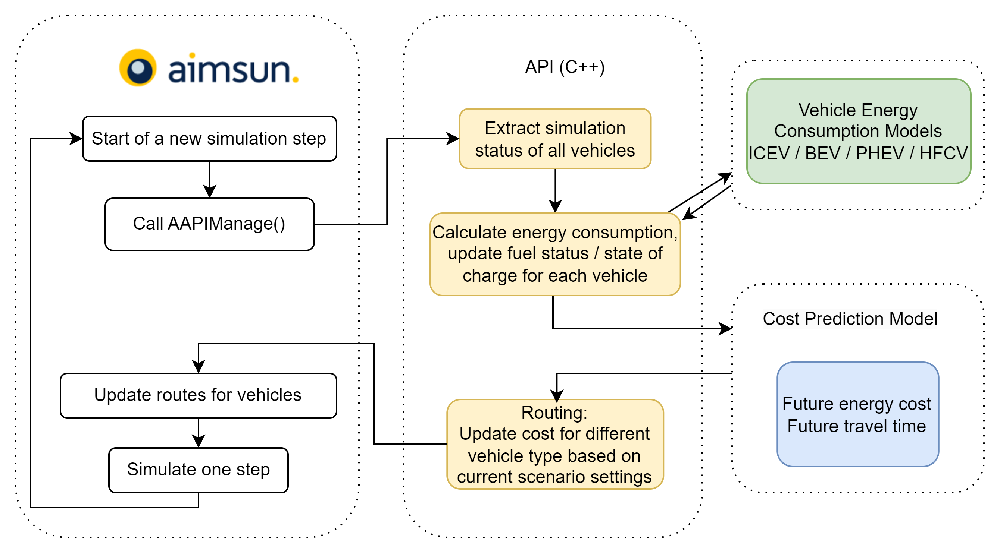

# Digital Twin with Aimsun

## Dependencies
- Aimsun 22.0.2
- C++ 11
- Python (for plotting)
  - pandas
  - seaborn
  - matplotlib

## Build the API target library for aimsun
- Open `AAPI.vcxproj` in Visual Studio 
- In file `AAPI.cxx`, update `PROJECT_DIR` with local directory of this repo
- Choose build type (Debug/Release) & (x64/x86). Release x64 is recommended.
    A Release build will generate a library named `AAPI_R.dll`, while a Debug build will have `AAPI_D.dll`
- Click Menu -> Build -> Build Solution

## Launch a simulation
- Open `aimsun_model/I66SubNetwork - DT/I66SubNetwork - DT.ang` with Aimsun
- In the project window, find the settings of the target scenarios under Project -> Scenarios. In the `Aimsun Next APIs` tab, disable all unknown APIs (excpet those), then add the locally built .dll library
- Save and run the simulation

## Directory architecture
- /aimsun_lib: official library from aimsun for API to link against
- /aimsun_model: aimsun models
  - /I66SubNetwork - DT: for development
  - /I66SubNetwork - DT_batch_demand50: only for batch experiments where demand is 50
  - /I66SubNetwork - DT_batch_demand100: only for batch experiments where demand is 100
  - /I66SubNetwork - DT_batch_demand150: only for batch experiments where demand is 150
  - /I66SubNetwork - DT_high_speed_100%ICE: increased highway speed limit
  - /I66SubNetwork - DT_presentation: for presentation use only
  - /I66SubNetwork - DT_original: original package from McMaster
  - /I66SubNetwork - DT_updated: updated package from McMaster

  note: carefully check the active API for every scenario is the expected one

- /data_history: historical data from a simulation (not used)
- /include: official header files from aimsun
- /ml_models: machine learning models (currently not supportted in aimsun)
- /plot_scripts: scripts to plot result figures
  - /figures: result figures
  - plot_global.py: read all batch summary data and concate them into a single dataframe, then prepare needed statistics for plot
  - read_and_plot.py: defined different plot functions
  - plot.ipynb: include examples to plot figures
- /pre_built_library: some pre-built API libraries for tests or batch experiments
- /scripts: back up of useful scripts of aimsun scripts model
- /sim_logs: all experiment results
  - summary.csv.txt: column names of the summary file
  - summary_demand50.csv / summary_demand100.csv / summary_demand150.csv: batch results for every demand level
  - /batch_summary
    - /20230809: the first batch results
    - /20230817: the second batch results (adding MPG and MPGe)
- /src_backup: backup of important API implementations

## Conduct a batch experiment
Ther are 5 variables that will decide an experiment: Demand_Percentage(%),	Prediction_Horizon(min),	CAV_Penetration(%),	Eco_Routing_with_Travel_Time(0/1), and	Vehicle_Fleet. We need to manually set these parameters. 

Each Aimsun Scenario has 11 replications, which are for 11 different CAV_Penetration.

Vehicle_Fleet need to be manualy changed in the script `script_Modify_CAV_percentage_all_scenario_based_on_scenario_name` around line 15.

Demand_Percentage(%),	Prediction_Horizon(min) and	Eco_Routing_with_Travel_Time(0/1) of a scenario can be quickly set by the scenario name. This will be done by script `script_Modify_CAV_percentage_all_scenario_based_on_scenario_name`, which is already in the simulation package. For example, `DT_Mixed_Fleet_D100_P5` represent a 100% demand, 5min prediction horizon and eco-routing scenario; `DT_Mixed_Fleet_Travel_Time_D50_P10` represent a 50% demand, 10min prediction horizon and travel time routing scenario. (`Travel_Time` needs to be explicitly present in the scenario name to represent the travel time routing). After setting the correct scenario name, right-click the target scenario and choose `scripts->script_Modify_CAV_percentage_all_scenario_based_on_scenario_name`, this will automaticly extract parameters from the scenario name and populate all needed fields and attributes to all the experiments under the target scenario.

After setting all experiment variables, you can launch all experiments (now there are 11 in each scenario for 11 different CAV penetration) in batch mode in one scenario by right-clicking the scenario and choose `scripts->script_Execute_replications_in_the_target_scenario`. You may also use `script_Execute_all_replications_in_all_scenario` to launch all experiments in multiple scenarios by providing scenario ids.

Note: currently, there are some memory issues in the simulation package, need to restart the Aimsun after about 50 replications, otherwise the system may crash due to memory leak.

## Aimsun specificatoins
1. Traffic demand: There are 8 types of vehicles in the simulation, ICE, ICE_NONCAV, BEV, BEV_NONCAV, PHEV, PHEV_NONCAN, HFCV, HFCV_NONCAV. The traffic demand `Demand Mixed Fleet` is designed to be suitable for any experiments. 
The distribution among these vehicles are controlled by aimsun `Variables` defined in the `Experiments`. `$demand_percentage` are defined in the scenario level. 
`Demand Mixed Fleet` and scenario/experiment variables collaboratively decide the final traffic demand and vehicle fleet distribution. Note that `script_Modify_CAV_percentage_all_scenario_based_on_scenario_name` will help to populate all the variables.

1. Link cost: Link cost are sent from API to aimsun by means of updating attributes. Each section has 5 user defined attributes: ice, bev, phev, hfcv and travel_time. These are cost for 4 types of powertrains and the cost of travel_time. These attributes are dynamically updated by the API library before every routing choice. 

1. Experiment attributes: There are 5 user defined attributes for each experiment: cav_penetration, demand_percentage, eco_routing_with_travel_time, prediction_horizon and vehicle_fleet. These are used to send experiment configurations to the API library so that the API will dynamically decide which cost to write. Note that `script_Modify_CAV_percentage_all_scenario_based_on_scenario_name` will help to populate all the attributes. Manual modification of these attributes might not work as intended.

## API architecture

### Data structure:
There are three local classes (Class Network, Class Link, Class Vihicle) which are used to record simulation data, especially for energy-related and cost-related data. 

The Class Network will include instances of Class Vehicle and Class Link. There is only one instance of Class Network within the running process of a single replication. This instance `network` will record all needed data. 

All instances of Class Link are member variables of the Class Network, and will be initialized in function `AAPIInit()`. The recorded historical data of the link-level cost, which are for moving average, are stored seperatelly in the each link.

Instances of Class Vehicle may be in the Network or in a Link, sometimes a dummy vehicle will be created to accumulate energy consumptions in a short time of period, e.g. 1min for the moving average interval, or for the second hour's statistics.

### Main functions:

AAPIInit() is called before the start of simulation, will calculate the default costs based on speed limit for every section, and update the initial cost to the default value.

AAPIManage() is called before every simulation step. This funciton will record every vehicles' energy consumption into a local object of helper class Vehicle, and also update some specific statitics, e.g. statistics for the second hour only. This function will also update the network level cost data at a predefined rate (now is every 60 seconds), which is for moving average.

AAPIPreRouteChoiceCalculation() is called everytime before the updates of routings. This function will update link costs based on current settings (real-time routing / predictive routing & eco-routing / travel-time routing). Cost prediction module is also invoked in this function.

AAPIFinish() is called at the end of a simulation. It will prepare or update all desired statistics and output them into the `summary.csv` file.

There are two overloading Emission functions.

  - void Emission(double spd, double grade, double acc, VehicleType vehicle_type, double& energy1, double& energy2, double cur_soc = 0.88)

    Calculate emission of a single vehicle type, used in AAPIManage() 

  - void Emission(double spd, double grade, double acc, double& E_ice, double& E_bev, double& E_phev1, double& E_phev2, double& E_hfcv)
  
    Calculate emission for all 4 types of powertrain, only used in AAPIInit()

